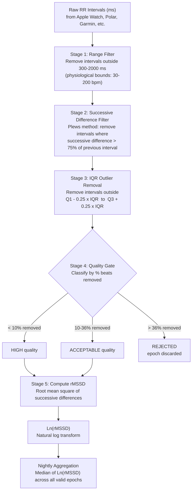

# HRV rMSSD & Sleep Score Algorithms

Open-source HRV rMSSD artifact correction and composite sleep scoring algorithms, extracted from a HealthKit-based iOS app for transparency and peer review.

These algorithms power [IntervalsWellnessSync](https://apps.apple.com/app/intervalswellnesssync/id6738964449), which syncs Apple Watch health data -- including nightly HRV and sleep scores -- to [Intervals.icu](https://intervals.icu).

The library is pure Swift with zero platform dependencies (no HealthKit, no UIKit). It accepts raw numeric inputs and returns structured results, making it usable in any Swift project or as a reference implementation in other languages.

---

## Table of Contents

1. [HRV rMSSD Algorithm](#hrv-rmssd-algorithm)
2. [Sleep Score Algorithm](#sleep-score-algorithm)
3. [Quick Start](#quick-start)
4. [Key Research References](#key-research-references)
5. [Limitations](#limitations)
6. [Contributing](#contributing)
7. [License](#license)

---

## HRV rMSSD Algorithm

Heart rate variability (HRV) is quantified using **rMSSD** -- the root mean square of successive differences between adjacent RR intervals. rMSSD reflects short-term, beat-to-beat vagal (parasympathetic) activity and is the gold standard metric for athlete HRV monitoring (Buchheit 2014, Plews et al. 2013).

Raw RR intervals from wrist-worn PPG sensors contain motion artifacts, ectopic beats, and noise. The pipeline below applies three sequential artifact correction stages, a quality gate, and then computes rMSSD from the surviving intervals.

### Pipeline Overview



### Stage-by-Stage Detail

#### Stage 1 -- Range Filter

Removes RR intervals outside the physiological range of **300 ms to 2000 ms**, corresponding to heart rates of approximately 30 to 200 bpm. Values outside this range are hardware artifacts or non-cardiac detections.

```
Valid if:  300 ms  <=  RR interval  <=  2000 ms
```

#### Stage 2 -- Successive Difference Filter

Implements the **Plews et al. (2017)** first-pass artifact filter. An interval is removed if its absolute difference from the preceding interval exceeds **75%** of the preceding interval's value. This catches sudden jumps caused by missed or extra beats.

```
Remove interval[i]  if:  |interval[i] - interval[i-1]|  >  0.75 * interval[i-1]
```

#### Stage 3 -- IQR Outlier Removal

Applies a tight interquartile range filter using a **0.25x IQR multiplier** (Plews et al. 2017). Standard boxplot rules use 1.5x IQR; the narrower multiplier here is intentional for PPG data where subtle artifacts survive the successive difference filter.

```
Q1 = 25th percentile
Q3 = 75th percentile
IQR = Q3 - Q1
Valid if:  Q1 - 0.25 * IQR  <=  interval  <=  Q3 + 0.25 * IQR
```

#### Stage 4 -- Quality Gate

Each epoch is classified based on the proportion of beats removed across all three filtering stages:

| Beats Removed | Classification | Action |
|---------------|----------------|--------|
| < 10%         | **High**       | Included in nightly aggregation |
| 10 -- 36%     | **Acceptable** | Included in nightly aggregation |
| > 36%         | **Rejected**   | Excluded from aggregation |

The 36% rejection threshold comes from **Sheridan et al. (2020)**, who demonstrated that rMSSD remains reliable when up to 36% of beats are corrected. The 10% high-quality threshold is a conservative bound indicating minimal artifact contamination.

#### Stage 5 -- rMSSD Computation

Computes the root mean square of successive differences from the cleaned interval array:

```
rMSSD = sqrt( (1/N) * SUM( (RR[i] - RR[i-1])^2 ) )   for i = 1..N
```

The result is then natural-log transformed: **Ln(rMSSD)**. The log transform normalizes the right-skewed distribution of rMSSD values, making day-to-day comparisons and trend detection more meaningful (Plews et al. 2013).

#### Nightly Aggregation

The nightly HRV value is the **median of Ln(rMSSD)** across all valid (non-rejected) epochs. The median is used rather than the mean because it is robust to outlier epochs -- a single noisy epoch does not distort the nightly reading. This approach aligns with the Oura Ring methodology and the Plews/Buchheit framework for longitudinal HRV monitoring.

### Threshold Summary

| Parameter | Value | Rationale |
|-----------|-------|-----------|
| RR interval range | 300 -- 2000 ms | Physiological bounds (30 -- 200 bpm) |
| Successive difference threshold | 75% | Plews et al. (2017) |
| IQR multiplier | 0.25x | Plews et al. (2017) |
| Max beat removal (rejection) | 36% | Sheridan et al. (2020) |
| High quality threshold | < 10% | Conservative threshold for minimal artifact |
| Nightly aggregation method | Median of Ln(rMSSD) | Robust to outlier epochs; aligns with Oura methodology |

---

## Sleep Score Algorithm

The sleep score is a composite value from **0 to 100** computed from five weighted components. Each component is independently scored on a 0-100 scale, then combined using the weights below.

### Component Weights

| Component       | With HR Data | Without HR Data |
|-----------------|--------------|-----------------|
| Duration        | 30%          | 34%             |
| Sleep Stages    | 25%          | 28%             |
| Continuity      | 20%          | 22%             |
| Efficiency      | 15%          | 16%             |
| Heart Rate      | 10%          | --              |

When heart rate data is unavailable, the 10% HR weight is redistributed proportionally across the remaining four components.

### Component Details

#### 1. Duration (30%)

Scores total actual sleep time. The optimal range is **7 to 9 hours** (score = 100).

| Sleep Duration | Score Range |
|----------------|-------------|
| 7 -- 9 hours   | 100         |
| 6 -- 7 hours   | 60 -- 100   |
| 5 -- 6 hours   | 30 -- 60    |
| < 5 hours      | 0 -- 30     |
| 9 -- 10 hours  | 80 -- 100   |
| > 10 hours     | 50 -- 80    |

#### 2. Sleep Stages (25%)

Evaluates the adequacy of **deep sleep** and **REM sleep** as a percentage of total sleep time.

- **Deep sleep target**: 13 -- 23% of total sleep
- **REM sleep target**: 20 -- 25% of total sleep
- The component score is the average of the deep and REM sub-scores

If no sleep stage data is available (e.g., older devices that report only `asleepUnspecified`), this component falls back to a default score of **70** -- a neutral value that avoids penalizing users whose hardware does not provide stage breakdowns.

#### 3. Continuity (20%)

Penalizes fragmented sleep. Gaps between sleep periods longer than **5 minutes** count as wake-ups. The score is reduced by:

- **20 points** per significant wake-up
- **0.5 points** per minute of total wake time

Uninterrupted sleep scores 100.

#### 4. Efficiency (15%)

Sleep efficiency is the ratio of actual sleep time to total time in bed (from first sleep period start to last sleep period end).

| Efficiency | Score Range |
|------------|-------------|
| >= 90%     | 100         |
| 85 -- 90%  | 80 -- 100   |
| 75 -- 85%  | 50 -- 80    |
| < 75%      | 0 -- 50     |

#### 5. Heart Rate (10%)

Lower average sleeping heart rate scores higher, reflecting better cardiovascular fitness and parasympathetic tone.

| Avg Sleeping HR | Score |
|-----------------|-------|
| <= 50 bpm       | 100   |
| <= 55 bpm       | 95    |
| <= 60 bpm       | 85    |
| <= 65 bpm       | 70    |
| <= 70 bpm       | 55    |
| <= 75 bpm       | 40    |
| > 75 bpm        | 40 - 2 * (HR - 75), min 10 |

If no heart rate data is available, this component is omitted and its weight is redistributed as shown in the weight table above.

---

## Quick Start

### Add via Swift Package Manager

In Xcode, go to **File > Add Package Dependencies** and enter:

```
https://github.com/rggrgurich/intervalswellnesssync-hrv-sleep-score-algorithms
```

Or add it to your `Package.swift`:

```swift
dependencies: [
    .package(
        url: "https://github.com/rggrgurich/intervalswellnesssync-hrv-sleep-score-algorithms",
        from: "1.0.0"
    )
]
```

### HRV Processing

```swift
import HRVSleepAlgorithms

let processor = HRVProcessor()

// Process a single epoch of RR intervals (in milliseconds)
let epoch = processor.processEpoch(
    rrIntervals: [823, 831, 847, 812, 798, 835, 821, 809, 843, 826,
                  818, 840, 805, 833, 811, 849, 822, 837, 801, 828],
    startTime: Date(),
    endTime: Date().addingTimeInterval(300)
)

print("rMSSD: \(epoch.rmssd) ms")
print("Ln(rMSSD): \(epoch.lnRmssd)")
print("Quality: \(epoch.quality.rawValue)")
print("Beats removed: \(epoch.beatsRemoved)/\(epoch.beatsTotal)")

// Process a full night of epochs
let nightEpochs: [(rrIntervals: [Double], start: Date, end: Date)] = [
    // Each tuple contains RR intervals and the epoch's time window
    (rrIntervals: [823, 831, 847, ...], start: epoch1Start, end: epoch1End),
    (rrIntervals: [810, 825, 839, ...], start: epoch2Start, end: epoch2End),
    // ... more epochs across the night
]

if let nightResult = processor.processNight(epochs: nightEpochs) {
    print("Median rMSSD: \(nightResult.medianRmssd) ms")
    print("Valid epochs: \(nightResult.epochsValid)/\(nightResult.epochsTotal)")
}
```

### Sleep Scoring

```swift
import HRVSleepAlgorithms

let calculator = SleepScoreCalculator()

let sleepPeriods: [SleepPeriod] = [
    SleepPeriod(startDate: bedtime, endDate: bedtime + 1.5.hours, stage: .asleepCore),
    SleepPeriod(startDate: /* ... */, endDate: /* ... */, stage: .asleepDeep),
    SleepPeriod(startDate: /* ... */, endDate: /* ... */, stage: .asleepREM),
    // ... additional periods
]

if let result = calculator.calculateScore(
    sleepPeriods: sleepPeriods,
    totalSleepSeconds: 27000,   // 7.5 hours
    avgSleepingHR: 52.0         // pass nil if unavailable
) {
    print("Sleep score: \(result.score)/100")
    print("Duration: \(result.durationScore)")
    print("Stages: \(result.stageScore)")
    print("Continuity: \(result.continuityScore)")
    print("Efficiency: \(result.efficiencyScore)")
}
```

---

## Key Research References

### Reviews and Methodological Frameworks

1. **Buchheit, M. (2014).** Monitoring training status with HR measures: Do all roads lead to Rome? *Frontiers in Physiology*, 5, 73. -- Comprehensive review establishing rMSSD as the preferred HRV metric for athlete monitoring.

2. **Plews, D. J., Laursen, P. B., Stanley, J., Kilding, A. E., & Buchheit, M. (2013).** Training adaptation and heart rate variability in elite endurance athletes: Opening the door to effective monitoring. *Sports Medicine*, 43(9), 773--781. -- Framework for longitudinal HRV monitoring using Ln(rMSSD) and the coefficient of variation.

3. **Sensors (2025) Narrative Review.** Monitoring training with HRV via mobile devices. -- Contemporary review of smartphone and wearable HRV monitoring methodologies.

4. **Plews, D. J., et al. (2014).** Heart rate variability and training intensity distribution in elite rowers. *International Journal of Sports Physiology and Performance*, 9(6), 1026--1032. -- Established minimum 3 days/week compliance for meaningful HRV trend data.

### Sleep Stage HRV Reliability

5. **Penn State Study (2022).** rMSSD reliability across sleep stages. -- Demonstrated that rMSSD measured during different sleep stages provides consistent parasympathetic indices.

6. **Herzig, D., et al. (2017).** Reproducibility of heart rate variability is parameter and sleep stage dependent. *Frontiers in Physiology*, 8, 1100. -- Quantified HRV reproducibility across NREM and REM stages.

7. **Boudreau, P., et al. (2013).** Circadian variation of heart rate variability across sleep stages. *Sleep*, 36(12), 1919--1928. -- Characterized the circadian modulation of HRV during sleep, informing whole-night aggregation strategies.

8. **PMC 8923916.** Aggregating HRV indices across sleep epochs. -- Methodological guidance on computing nightly HRV from epoch-level measurements.

### Artifact Correction and Data Quality

9. **Sheridan, S., et al. (2020).** How much artifact correction is too much? Determining the effect of automated artifact algorithms on rMSSD. *Sensors*, 20(21), 6124. -- Established that rMSSD remains reliable when up to 36% of beats are corrected, and degrades beyond that threshold.

10. **Saboul, D., et al. (2022).** Sensitivity of rMSSD to artifacts in RR interval time series. *Sensors*, 22(11), 4153. -- Quantified rMSSD error as a function of artifact density, supporting aggressive filtering for PPG data.

11. **Lipponen, J. A., & Tarvainen, M. P. (2019).** A robust algorithm for heart rate variability time series artefact correction using novel beat classification. *Journal of Medical Engineering & Technology*, 43(3), 173--181. -- The Kubios automatic artifact correction algorithm; informs the multi-stage filtering approach.

### Wearable Validation

12. **PMC 12367097 (2025).** Nocturnal HRV validation across consumer wearables. -- Cross-device validation of overnight HRV measurements from consumer wrist-worn devices against ECG reference.

13. **PMC 11644394 (2024).** Oura Ring rMSSD accuracy. -- Validation of the Oura Ring's rMSSD measurements, relevant to the median aggregation methodology shared by this algorithm.

14. **Apple (2025).** Sleep stage estimation validation. -- Apple's published validation data for Apple Watch sleep stage classification accuracy.

15. **SLEEP Advances (2025).** Six-device wearable sleep staging comparison. -- Multi-device comparison of sleep staging accuracy, contextualizing the Apple Watch deep sleep (~62%) and REM (~81%) accuracy figures.

---

## Limitations

- **PPG noise.** Photoplethysmography from wrist-worn devices is inherently noisier than chest-strap ECG. The multi-stage artifact correction pipeline mitigates this, but some residual error remains.

- **Sleep stage accuracy.** Apple Watch sleep stage classification accuracy is approximately 62% for deep sleep and 81% for REM sleep. Stage-level analysis should be interpreted with this margin of error in mind.

- **All-stage capture.** The algorithm captures HRV epochs during all sleep stages, not just NREM. While NREM epochs theoretically provide more stable HRV readings, restricting to NREM on Apple Watch would amplify noise from stage misclassification (misclassified REM epochs excluded, misclassified NREM epochs included). Including all stages and relying on the artifact correction pipeline produces more consistent nightly values.

- **Individual reading variance.** Individual rMSSD readings from PPG can vary more than 10% from ECG reference values. Nightly aggregation via the median across multiple epochs cancels random error, making the nightly value substantially more reliable than any single epoch.

---

## Contributing

If you spot issues with the methodology, thresholds, or implementation, please open an issue or PR. Contributions are welcome in the following areas:

- Corrections to artifact correction thresholds backed by newer research
- Additional validation data or benchmark comparisons
- Improved documentation or citations
- Bug fixes in the filtering or scoring logic
- Ports to other languages (Python, Kotlin, etc.)

---

## License

MIT License. See [LICENSE](LICENSE) for details.
